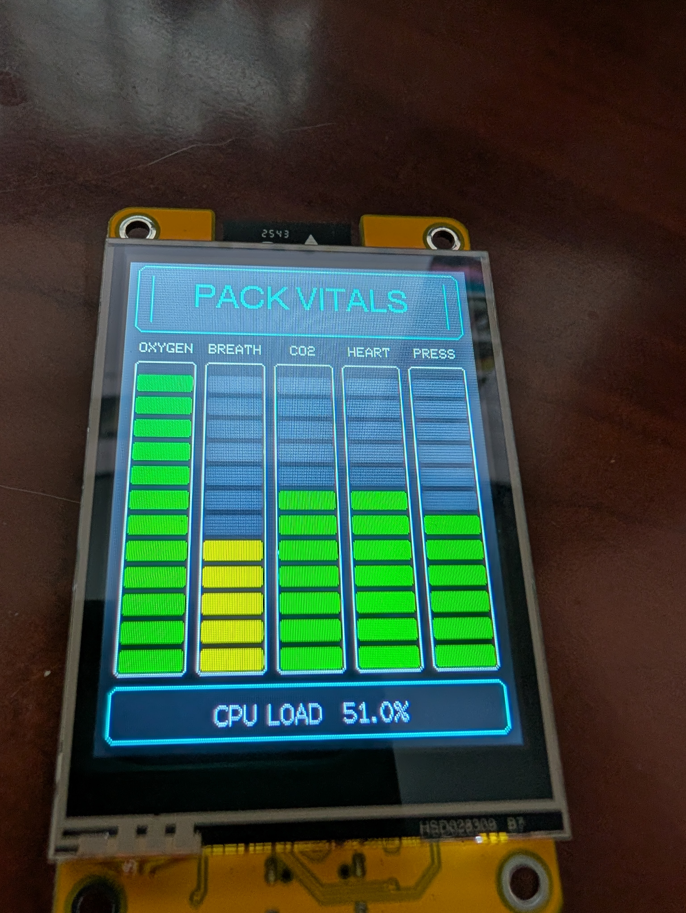
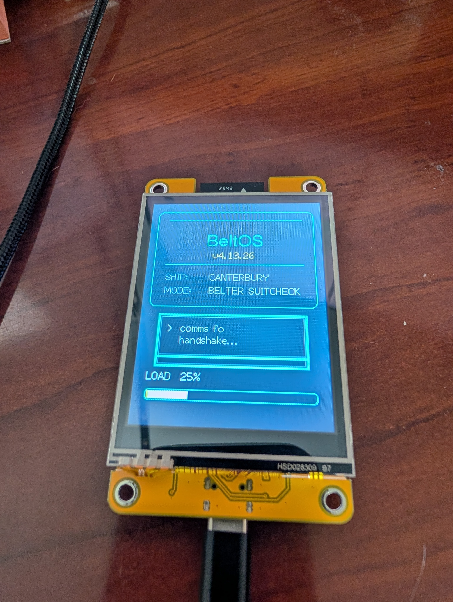

# PackOS – Belter Backpack Display
### ESP32 Telemetry UI (Inspired by *The Expanse*)



A portable, sci-fi-inspired telemetry display built on an ESP32 with a 2.8" LCD.  
Designed for prop builds, wearables, and experimentation.

---

## Features

- Belter-style UI (“PACK STATUS”, telemetry bars, alerts)
- Animated boot sequence
- Auto-layout adapts to screen size
- USB-C or battery powered (LiPo with onboard charging)
- Modular code structure for easy customization

---

## Screens

### Boot Sequence


### Main UI


---

## Hardware

### Tested Hardware

- Hoyson 2.8" ESP32 LCD Display  
  <https://www.amazon.com/dp/B0D92C9MMH>

This board is:
- Fully assembled (no soldering required)
- USB-C powered
- Powerful and inexpensive

### Supported Platforms

| Platform | Status |
|--------|--------|
| ESP32 / ESP32-S2 / ESP32-S3 | ✅ Supported |
| RP2040 (Philhower core) | ⚠️ Should work |
| AVR (Uno, 32u4, etc.) | ❌ Not supported |

Examples:
- Adafruit Feather ESP32 V2
- ESP32-S3 boards
- RP2040 Feather (with TFT_eSPI support)

### Display Support

- Optimized for **2.8\" 240x320**
- Tested on **4\" 320x480 (Hoyson)**
- UI adapts automatically based on vertical resolution

### Additional Requirements

- USB-C cable (programming + power)
- Optional: 3.7V LiPo battery

### Board Overview


---

## 🔌 Power

- **USB-C** → Power + charging  
- **BAT port** → 3.7V LiPo battery only  

⚠️ Do NOT apply 5V to the BAT connector.

---

## Setup Guide

### 1. Install Arduino IDE
<https://www.arduino.cc/en/software>

### 2. Install ESP32 Board Support

Go to:

**File → Preferences → Additional Board Manager URLs**

Add:

```text
https://raw.githubusercontent.com/espressif/arduino-esp32/gh-pages/package_esp32_index.json
```

Then:

**Tools → Board → Boards Manager → Install “ESP32 by Espressif Systems”**

### 3. Select Board

```text
Tools → Board → ESP32 Dev Module
```

This works for most ESP32 display boards.

### 4. Install Libraries

Install via Library Manager:

- **TFT_eSPI** (required)

---

## ⚙️ Display Configuration (Critical)

You **must configure TFT_eSPI correctly** or the screen will not work.

### Step 1: Select Driver

Edit:

```text
TFT_eSPI/User_Setup.h
```

In **Section 1**, uncomment **one** driver:

```cpp
#define ILI9341_DRIVER       // 2.8" Hoyson
//#define ST7796_DRIVER      // 4" Hoyson
```

### Step 2: Set Pins

In **Section 2**, edit:

// ###### EDIT THE PIN NUMBERS IN THE LINES FOLLOWING TO SUIT YOUR ESP32 SETUP   ######
// For ESP32 Dev board (only tested with ILI9341 display)  Use for Hoyson Modules.
// The hardware SPI can be mapped to any pins

#define TFT_MOSI 13
#define TFT_MISO 12
#define TFT_SCLK 14

#define TFT_CS   15
#define TFT_DC    2
#define TFT_RST  -1

#define TFT_BL   21   // 2.8" display
//#define TFT_BL   27  // 4" display

#define TOUCH_CS 33
#define TFT_BACKLIGHT_ON HIGH
```

## ⚡ Compile & Upload

1. Connect the board via USB-C  
2. Select the correct COM port  
3. Click **Compile**

### If Compile fails

- Look at the error message closely, and trying uploading to an LLM like ChatGPT or Gemini to help troubleshoot.
- Verify the correct board and port are selected
- Try a different USB cable if needed

---

## 🧠 Configuration & Customization

This project is designed to be easy to modify.

At the top of the .ino file is a QUICK SETUP sections with variable easy to change - they are well documented

### Change the orientation
constexpr bool USE_PORTRAIT_MODE = true;  Sets to Portrait orientation  
constexpr bool USE_PORTRAIT_MODE = false; Sets to Landscape orientation.

The UI adapts based on **available vertical space**, not just portrait vs. landscape mode.

## Project Structure

```text
PackOS/
├── README.md
├── images/
│   ├── hero.jpg
│   ├── boot.jpg
│   ├── ui.jpg
│   └── board.jpg
└── src/
    └── PackOS.ino
```


## Troubleshooting

### Blank screen

- Check TFT_eSPI driver selection
- Verify pin configuration
- Confirm the correct display driver is enabled

### Upload fails

- Hold the **BOOT** button
- Check that the USB cable supports data, not just charging
- Make sure the correct COM port is selected

---

## Future Enhancements

- Touch-based configuration menu
- Battery level monitoring
- SD card assets (images/audio)

---

## License

MIT License – feel free to use and modify.

---

## Credits

Inspired by the UI and aesthetic of *The Expanse*.
Based on original backpack code written by Mark Perino and modified by Dan Shope in April 2021.
