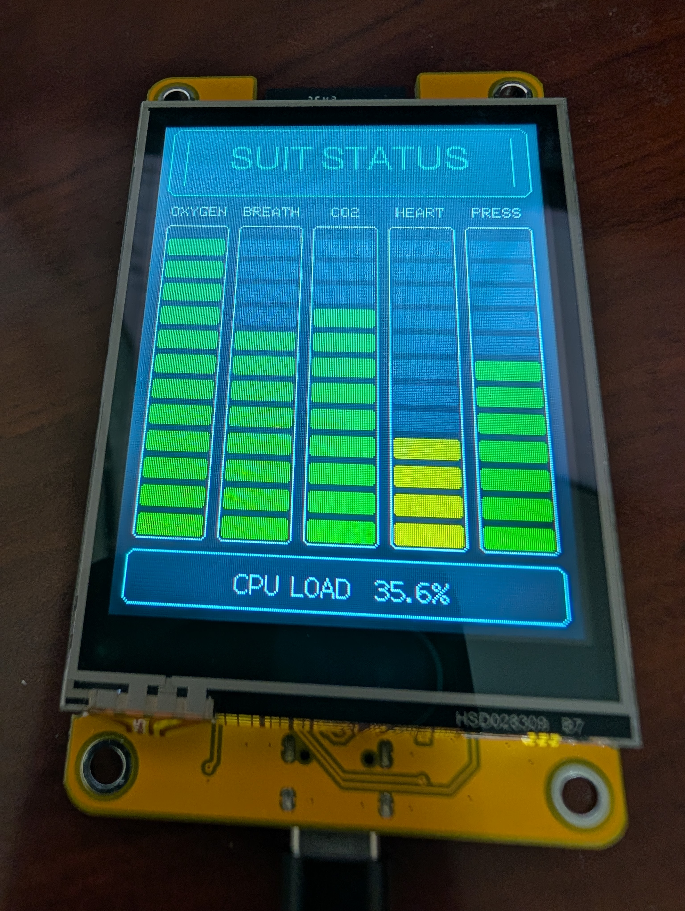
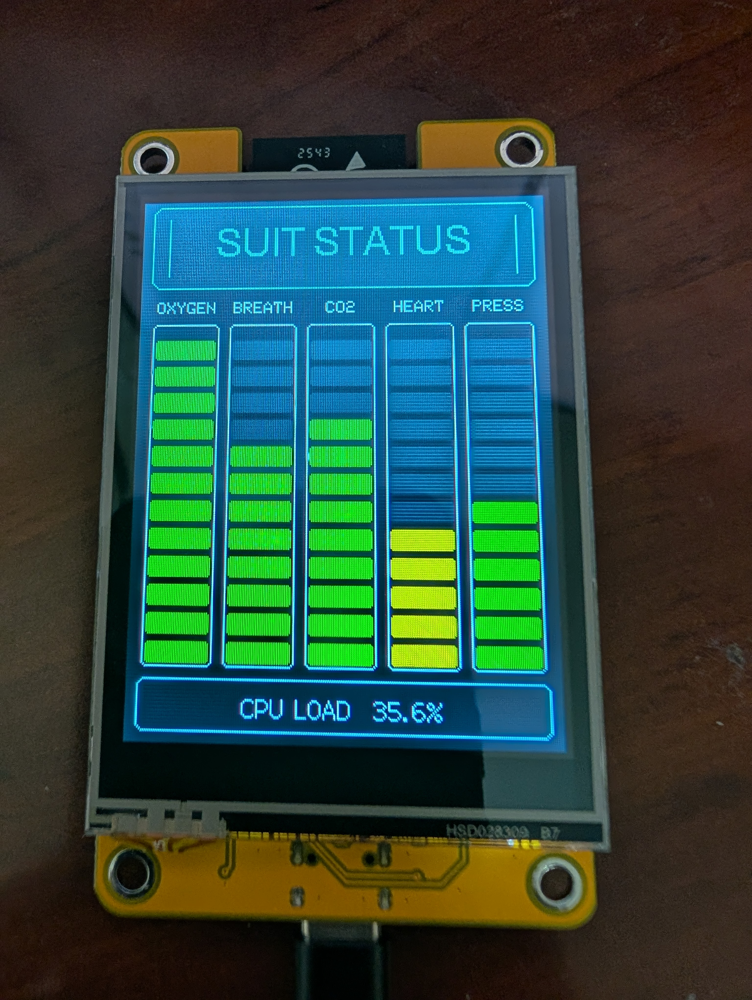
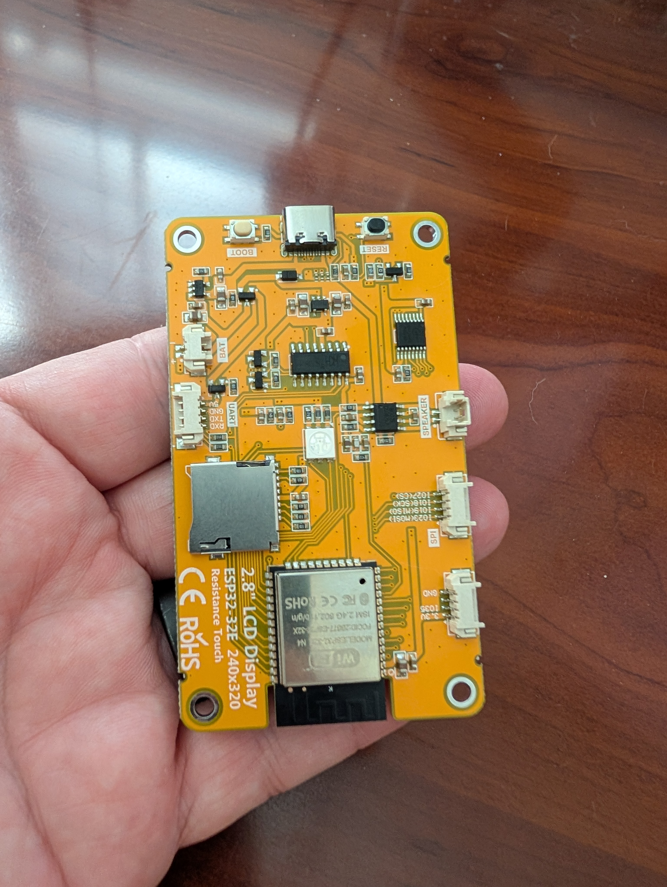
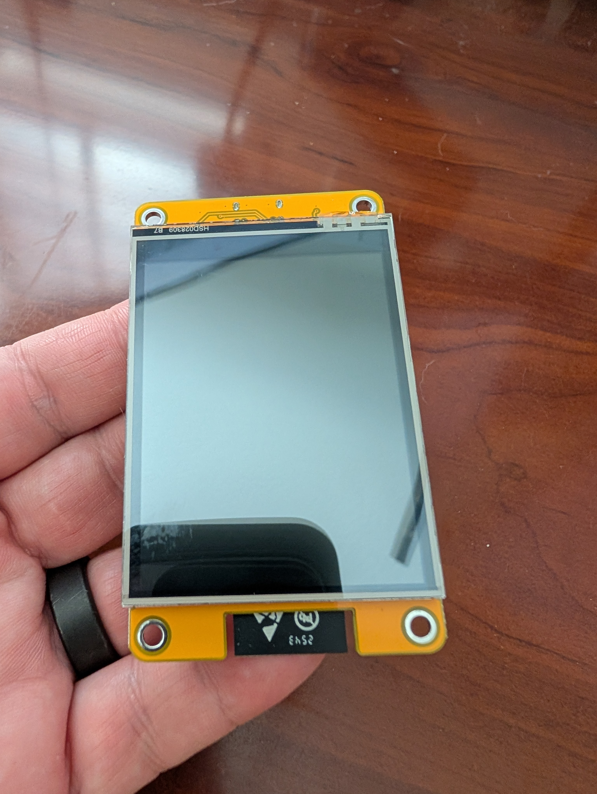

# PackOS – Belter Backpack Display
## ESP32 Telemetry UI (Inspired by The Expanse)



A portable, sci-fi-inspired telemetry display built on an ESP32 with a 2.8" LCD.  
Designed for prop builds, wearables, and experimentation.

---

## Features

- Belter-style UI (“PACK STATUS”, telemetry bars, alerts)
- Highly customizable for all messages and timers
- Animated boot sequence with belter inspired messages
- Auto-layout adapts to screen size and orientation
- USB-C or battery powered (LiPo with onboard charging)
- Modular code structure for easy customization

---

## Screens

| Boot Sequence | Main UI |
|--------------|--------|
|  |  |

---

## Hardware

### Tested Hardware

- Hoyson 2.8" ESP32 LCD Display  
  <https://www.amazon.com/dp/B0D92C9MMH>
- Hoyson 4" ESP32 LCD Display  
 <https://www.amazon.com/dp/B0FGJJ24S1>

This board is:
- Fully assembled (no soldering required)
- USB-C powered
- Powerful
- inexpensive

### PackOS Supported Microcontrollers

| Platform | Status |
|--------|--------|
| ESP32 / ESP32-S2 / ESP32-S3 | ✅ Supported |
| RP2040 (Philhower core) | ⚠️ Should work |
| AVR (Uno, 32u4, etc.) | ❌ Not supported |

Examples:
- Adafruit Feather ESP32 V2
- ESP32-S3 boards
- RP2040 Feather (with Philhower core TFT_eSPI support)

Any powerful and modern microcontroller with TFT support **should** run the code.

### Display Support

- Optimized for **2.8\" 240x320**
- Tested on **4\" 320x480**
- UI adapts automatically based on vertical resolution

### Additional Requirements

- USB-C cable (programming + power)
- Optional: 3.7V LiPo battery

### Board Overview
 

---

## 🔌 Power

- **USB-C** → Power + charging  
- **BAT port** → 3.7V LiPo battery only  

⚠️ Do NOT apply 5V to the BAT connector.

---

## Setup Guide

### 1. Install Arduino IDE - make sure installed the latest version!
<https://www.arduino.cc/en/software>

### 2. Install ESP32 Board Support

Go to:

**Tools → Board → Boards Manager → Install “ESP32 by Espressif Systems”**

### 3. Select Board

```text
Tools → Board → ESP32 Dev Module
```

This works for most ESP32 display boards including the Hoyson board that I used.

### 4. Install Libraries

Install via Library Manager:

- **TFT_eSPI** (required)

---

## Display Configuration (Critical)

You **must configure TFT_eSPI correctly** or the screen will not work.

### Step 1: Select Driver

Edit:

Find your Arduino librarires directory, if you installed to the default location, this should be document/arduino/libraries/TFT_eSPI

```text
TFT_eSPI/User_Setup.h
```

In **Section 1**, uncomment **one** driver that matches the display driver used by your board/display. e.g.

```cpp
#define ILI9341_DRIVER       // 2.8" Hoyson
//#define ST7796_DRIVER      // 4" Hoyson
```

### Step 2: Set Pins

In **Section 2**, edit:
```cpp
// ###### EDIT THE PIN NUMBERS IN THE LINES FOLLOWING TO SUIT YOUR ESP32 SETUP   ######
// For ESP32 Dev board (only tested with ILI9341 display)  Use for Hoyson Modules.
// The hardware SPI can be mapped to any pins

#define TFT_MOSI 13
#define TFT_MISO 12
#define TFT_SCLK 14

#define TFT_CS   15
#define TFT_DC    2
#define TFT_RST  -1

#define TFT_BL   21   // 2.8" display
//#define TFT_BL   27  // 4" display

#define TOUCH_CS 33
#define TFT_BACKLIGHT_ON HIGH
```

## Compile & Upload

1. Connect the board via USB-C  
2. Select the correct COM port  
3. Click **Compile**

### If Compile fails

- Look at the error messages closely, and trying uploading them to an LLM like ChatGPT or Gemini to help troubleshoot.
- Verify the correct board and port are selected
- Try a different USB cable if needed

## Configuration & Customization

This project is designed to be easy to modify.
At the top of the .ino file is a QUICK SETUP sections with variable easy to change - they are well documented.

Here is a subset of them...

```cpp
// =====================================================
// QUICK SETUP - SAFE TO EDIT
// =====================================================

// Boot screen text
constexpr const char* BOOT_TITLE = "OPA BeltOS"; //OS Name
constexpr const char* BOOT_VERSION = "v4.9.26"; //Version of this program
constexpr const char* BOOT_SYSTEM = "NYNGAN";  //This is the name of your ship

// Screen direction:
// true  = portrait
// false = landscape
constexpr bool USE_PORTRAIT_MODE = false;

// How active the display feels
// 1 = very calm
// 5 = balanced
// 10 = very active / busy
constexpr uint8_t ACTIVITY_LEVEL = 5;

// Turn all visual effects on or off
// Includes faded scanlines AND glitch effects
// false = clean display
// true  = sci-fi effects
constexpr bool SHOW_GLITCH = false;

// Show a fake OS loading sequence on the boot screen
constexpr bool SHOW_BOOT_LOADING = true;

// Test mode: start oxygen near the pre-alert zone for quick testing
constexpr bool ENABLE_LOW_OXYGEN_TEST_MODE = false;

// =====================================================
// Timers that you can play with
// =====================================================

// Boot text typing speed in milliseconds per step
constexpr uint16_t BOOT_TYPE_SPEED_MS = 10;

// How long the progress bar animation takes per boot step
constexpr uint16_t BOOT_PROGRESS_STEP_MS = 140;

// Pause after boot reaches 100%, in milliseconds
constexpr uint16_t BOOT_COMPLETE_PAUSE_MS = 4000;

// How long oxygen takes to drain from full to empty
constexpr uint16_t OXYGEN_DRAIN_MINUTES = 30;

// Low-oxygen pre-alert threshold as a percent
constexpr uint8_t LOW_OXYGEN_PREALERT_PERCENT = 15;

// Critical oxygen threshold as a percent
constexpr uint8_t LOW_OXYGEN_CRITICAL_PERCENT = 5;

// Starting oxygen percent when test mode is enabled
constexpr uint8_t LOW_OXYGEN_TEST_START_PERCENT = 12;


// =====================================================
// UI TUNING CONSTANTS
// =====================================================

// Alert / reboot text
constexpr const char* LOW_OXYGEN_TEXT = "LOW OXYGEN";
constexpr const char* CRITICAL_ALERT_LINE1 = "CRITICAL";
constexpr const char* CRITICAL_ALERT_LINE2 = "OXYGEN ALERT";
constexpr const char* REBOOT_LINE1 = "GOODBYE";
constexpr const char* REBOOT_LINE2 = "BERATNA";

// Main title at the top of the display
constexpr const char* PANEL_TITLE = "PACK VITALS";

// Boot console text
constexpr const char* BOOT_NODE_LABEL = "SHIP:";
constexpr const char* BOOT_MODE_LABEL = "MODE:";
constexpr const char* BOOT_MODE_VALUE = "BELTER SUITCHECK";
constexpr const char* BOOT_FINAL_LINE1 = "all system nomina,";
constexpr const char* BOOT_FINAL_LINE2 = "kopeng. suit stay running.";
constexpr const char* BOOT_LOAD_LABEL = "LOAD";
constexpr const char* BOOT_LOAD_COMPLETE_TEXT = "LOAD 100%";
constexpr const char* BOOT_PROMPT_PREFIX = "> ";
constexpr const char* BOOT_SECOND_LINE_PREFIX = "  ";

// Boot module lines - editable at top of file
static const char* BOOT_LINE1_TABLE[] = {
  "pak os wakey",
  "fo check air",
  "o2 line",
  "co2 scrubba",
  "recycla spin",
  "helmet hud",
  "mag boots",
  "comms fo",
  "opa channel",
  "pressure seal?",
  "pressure seal",
  "thermal line",
  "heart beat",
  "injector primed",
  "suit telem",
  "gyro stay",
  "power bus",
  "vac sensa",
  "helmet seal",
  "suit core",
  "clamp and latch",
  "maneuva pak",
  "fo beltalowda",
  "no leak"
};

static const char* BOOT_LINE2_TABLE[] = {
  "now, kopeng...",
  "you set or no?",
  "fo wake up...",
  "run now...",
  "up, sasa...",
  "fo sync...",
  "lock, gut...",
  "handshake...",
  "open now...",
  "you sure?",
  "fo hold...",
  "fo align...",
  "fo track...",
  "beratna...",
  "streamin...",
  "no spin...",
  "route clear...",
  "fo calibrate...",
  "tight, ke?",
  "shake hand...",
  "nomina...",
  "stand by...",
  "all set...",
  "no problem..."
};

// Headings above the bars
constexpr int NUM_BARS = 5;
constexpr const char* HEADINGS[NUM_BARS] = {
  "OXYGEN",
  "BREATH",
  "CO2",
  "HEART",
  "PRESS"
};

```

### Change the orientation
```cpp
constexpr bool USE_PORTRAIT_MODE = true;  Sets to Portrait orientation  
constexpr bool USE_PORTRAIT_MODE = false; Sets to Landscape orientation.
```

The UI adapts based on **available vertical space**, not just portrait vs. landscape mode.

The image below shows landscape mode on 


## Troubleshooting

### Blank screen

- Check TFT_eSPI driver selection
- Verify pin configuration
- Confirm the correct display driver is enabled

### Upload fails

- Hold the **BOOT** button
- Check that the USB cable supports data, not just charging
- Make sure the correct COM port is selected

---

## Future Enhancements

- Touch-based configuration menu
- Battery level monitoring
- SD card assets (images/audio)

---

## License

MIT License – feel free to use and modify.

---

## Credits

Inspired by the UI and aesthetic of *The Expanse*.
Based on original backpack code written by Mark Perino and modified by Dan Shope in April 2021.
